# Dynatrace internship interview task

This task was implemented using .Net on the backend and React application as the frontend.

## Startup on Windows 11:

To run this project, you need .Net 7 and Node.js (v18.16.0+) installed on your computer.

1. Download this project using `git clone https://github.com/evgenius081/dynatrace_task.git` command in terminal.
2. Open new terminal window in project parent folder.
3. In terminal type `cd Backend/BankApp.API`
4. In terminal type `dotnet run`
5. Open new terminal window in project parent folder.
6. In terminal type `cd Frontend`
7. In terminal type `npm install`
8. In terminal type `npm run build`
9. In terminal type `npm start`

**Alternatively**, you can run backend using Microsoft Visual Studio 2022 following these steps:
1. Open parent project folder
2. Open folder `Backend`
3. Open `Backend.sln` file in Visual Studio 2022 or newer
4. Choose `https` launch option if not chosen
5. Run the project using button or `Ctrl+F5`

**Alternatively**, you can run the entire solution using Docker (and it should be running). To do so,
1. Open new terminal window in project parent folder.
2. In terminal type `docker-compose up`
3. Open browser and proceed to page `http://localhost:3000`

## Run examples
### Using frontend
- Task 1 
    1. proceed to `http://localhost:3000/` or `http://localhost:3000/average`
  
        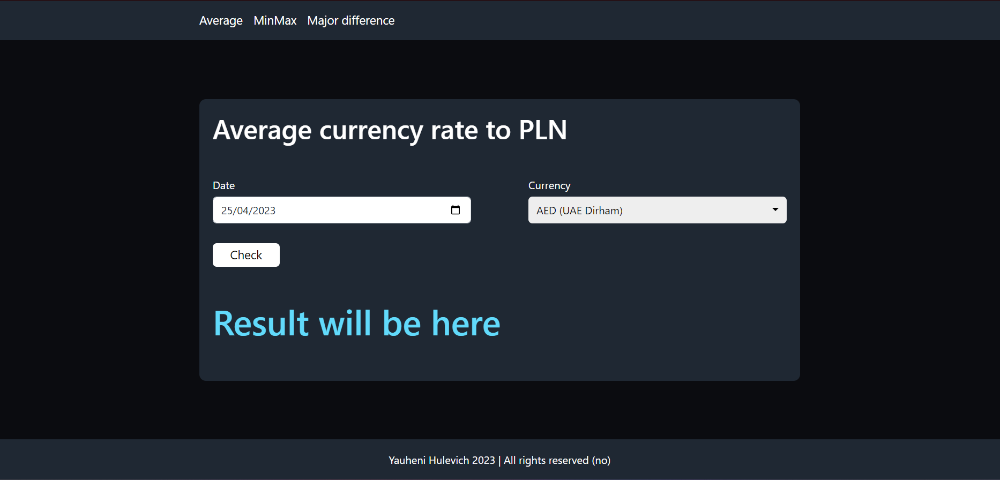

    2. choose date and currency , e.g. 21/04/2023 (depending on system and browser settings) and AUD (Australian Dollar)

        

    3. click on `Check` button

    **Expected result**:

    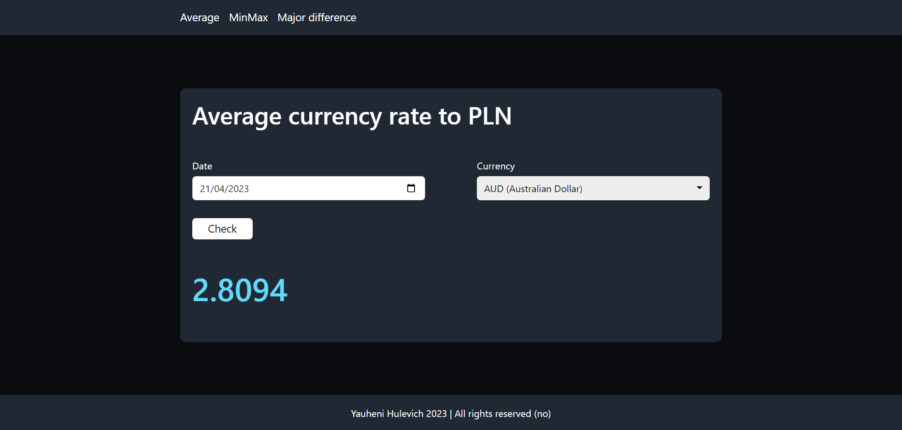

- Task 2
    1. proceed to `http://localhost:3000/minmax` 

        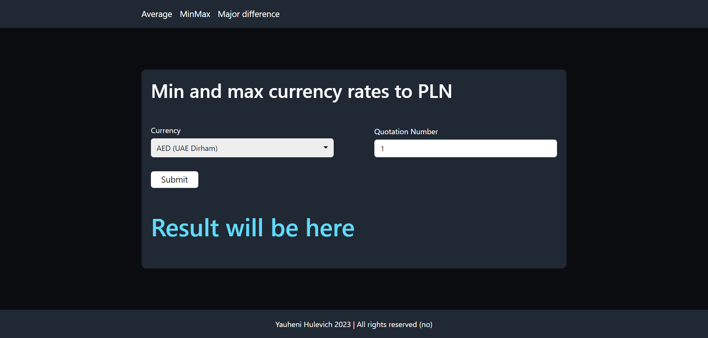

    2. choose currency and quotation number, e.g. AUD (Australian Dollar) and 10

        

    3. click on `Check` button

    **Expected result**:

    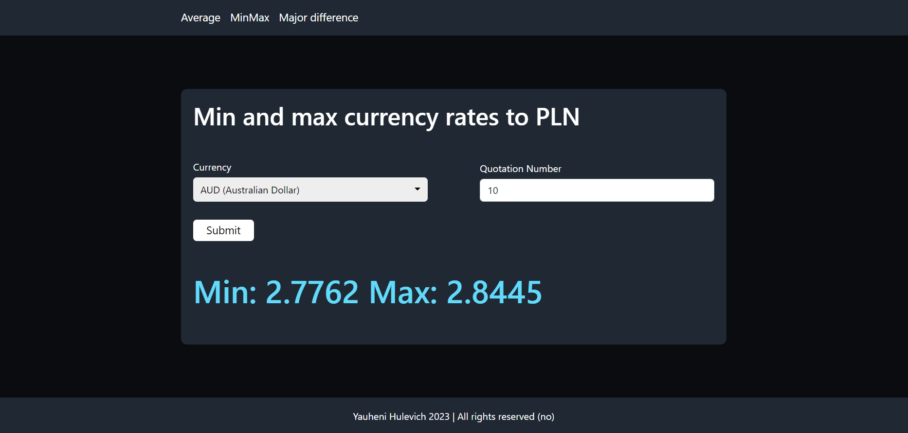

- Task 3
    1. proceed to `http://localhost:3000/major-difference` 

        
    
    2. choose currency and quotation number, e.g. AUD (Australian Dollar) and 10

        

    3. click on `Check` button

    **Expected result**:

    

- Case when request it ok, but there is no such data in NBP API
    1. proceed to `http://localhost:3000/` or `http://localhost:3000/average`
  
        

    2. choose date, e.g. 21/04/2023 (depending on system and browser settings)

        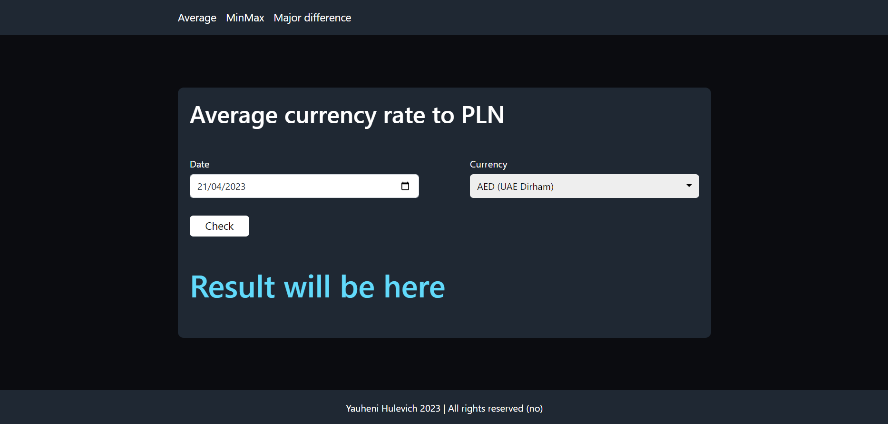

    3. click on `Check` button

    **Expected result**:

    

- Case when entered data is not ok, e.g. quotation number is too high
    1. proceed to `http://localhost:3000/major-difference` 

        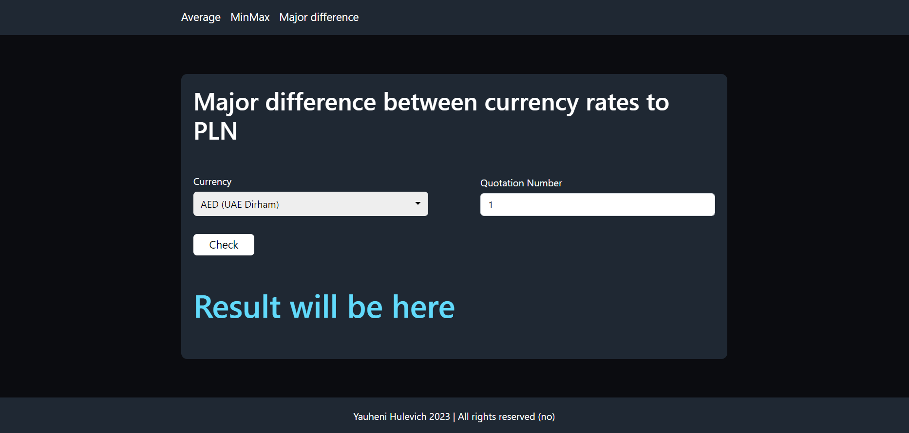
    
    2. choose quotation number higher than 255 or less then 1, e.g. 10000

        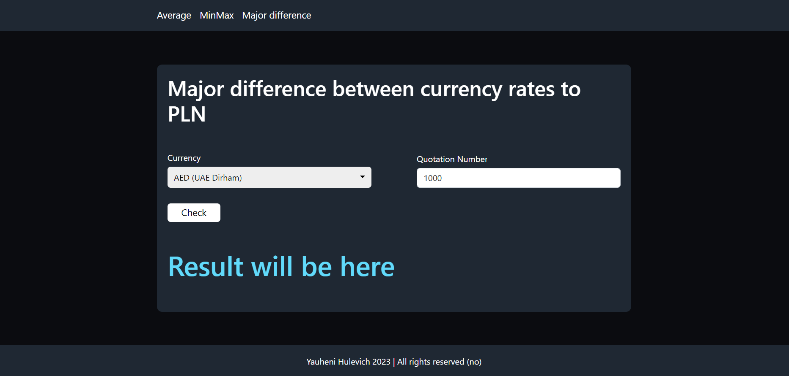

    3. click on `Check` button

    **Expected result**:

    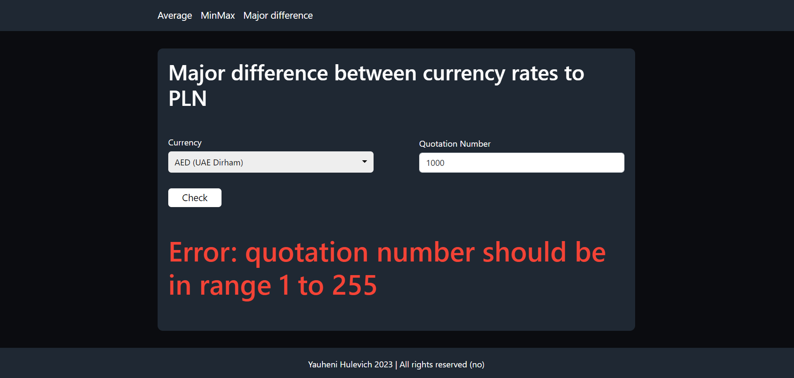

There are also pages for wrong address on the frontend (proceed to `http://localhost:3000/foo`) and internal BNP or my APIs errors (proceed to `http://localhost:3000/error`)

### Using Postman
Open Postman and import `Dynatrace task.postman_collection.json` file

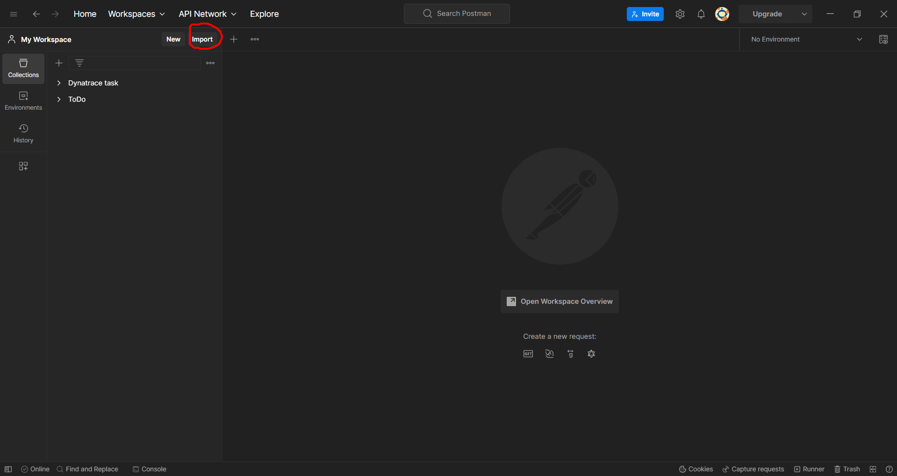
    
**Examplary test run**:

1. Choose test, click marked with green button and click `Send`

    **Note**: if you launched solution using Docker, choose tests from `Docker` folder

    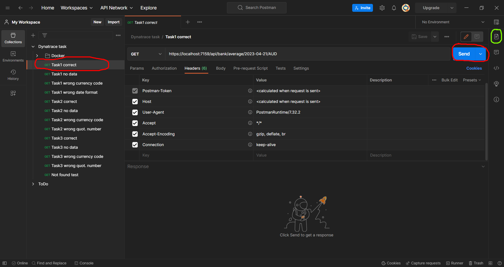

2. Here you can see the output and the expected result 

    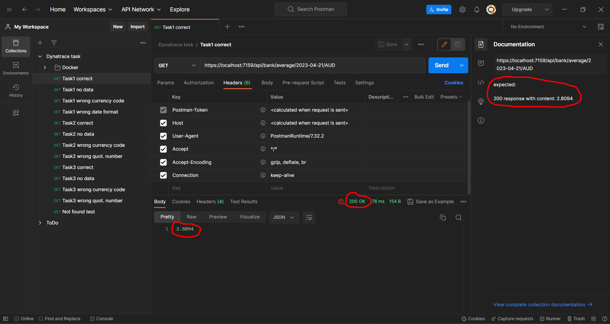

##Runnig tests
- Using Visual Studio:
    1. Open `Backend.sln` file in Visual Studio 2022 or newer
    2. Open `Test Explorer` (View->Test Explorer)
    3. Press `Run all tests` button
    
        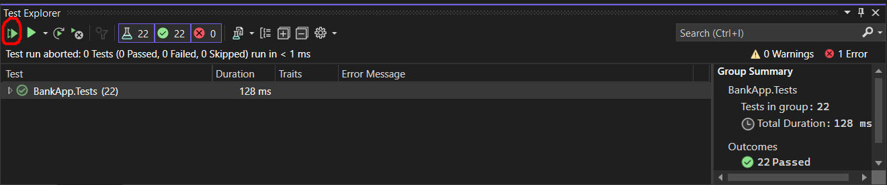
- Using termianl
    1. Open terminal window in project parent folder
    2. In terminal type `cd Backend/BankApp.Tests`
    3. In terminal type `dotnet test`
    

If you have any questions, feel free to contact yauheni.hulevich@gmail.com. If you want to see the commit history, welcome to this repo: https://github.com/evgenius081/dynatrace_task


----------------------------------------------------------------------------------------------------------------------------------------------------------------------


# Backend oriented task (Java/Python/JS/.NET)

## Description

Create a project, a simple runnable local server, that exposes some endpoints which take arguments and return plain simple data after performing certain internal operations.
The goal is to query data from the Narodowy Bank Polski's public APIs and return relevant information from them. User manual: http://api.nbp.pl/

## Considerations

- Table A only will be used for average exchange rates and table C for buy and sell rates. Reference: https://nbp.pl/en/statistic-and-financial-reporting/rates/
- Operations and examples can be found in the manual.
- Weekend dates or holidays, for example, do not return data.

## Required operations

Provide a separate endpoint for each operation:
1. Given a date (formatted YYYY-MM-DD) and a currency code (list: https://nbp.pl/en/statistic-and-financial-reporting/rates/table-a/), provide its average exchange rate.
2. Given a currency code and the number of last quotations N (N <= 255), provide the max and min average value (every day has a different average).
3. Given a currency code and the number of last quotations N (N <= 255), provide the major difference between the buy and ask rate (every day has different rates).

## Optional

The following features are not mandatory, but considered as a plus:
- Unit/integration tests.
- Docker image of the whole application.
- Swagger UI or any other simple front-end (with e.g. React, Angular).


## Guidelines

- It shouldn't take more than 1 day.
- Decide on how to decompose application layers.
- Pay attention to overall coding style and errors handling.
- Output format is not specified.
- No authentication nor security needed.
- Add readme with relevant information about how to run it and examples.

RESTful web API design reference: https://learn.microsoft.com/en-us/azure/architecture/best-practices/api-design

## Criteria

Provide succinct and direct instructions in the main readme to start the server and test the operations.

### Example

- To start the server, run this command:
```
python -m http.server
```
- To query operation 1, run this command (which should have the value 5.2768 as the returning information):
```
curl http://localhost:8888/exchanges/GBP/2023-01-02
```

Attention will be put on correct behaviour of operations, application structure, and general code quality (readability, naming, etc.).  
